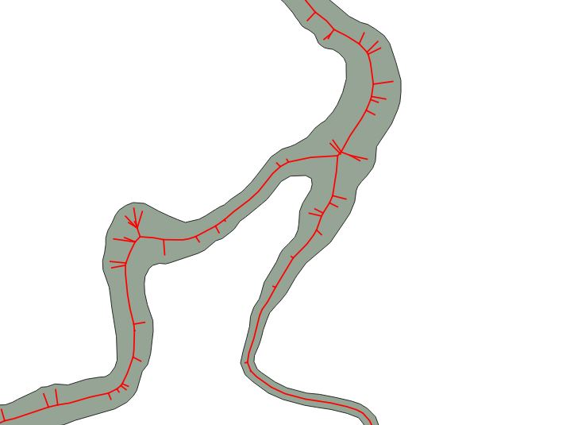
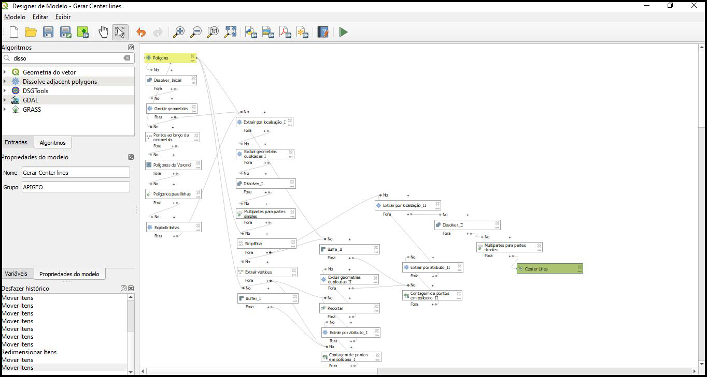
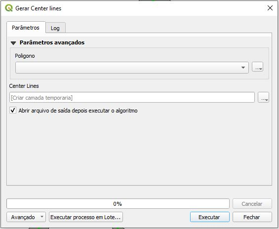
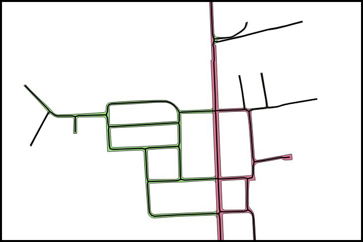
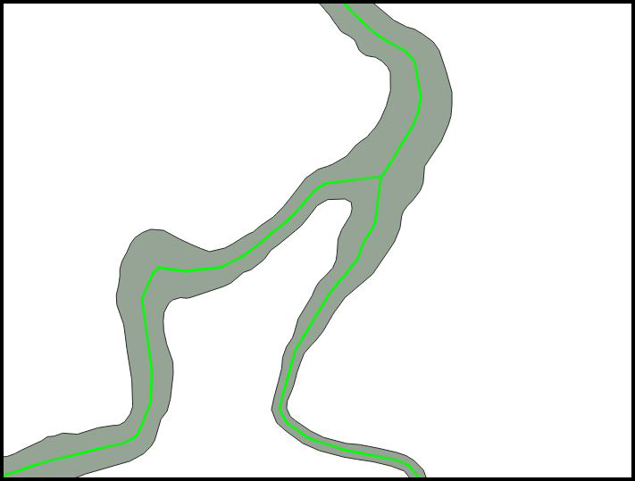

<h1 align="center">Gerar Center Lines</h1>
<h3 align="center">Gerando linhas central em polígonos</h3>
 

Criar linhas de centro a partir de uma geometria poligonal, é um recurso muito utilizado nos temas de hidrografia e sistema viário, onde é necessário criar as linhas de centro para definir o eixo de ambos, existem algumas ferramentas já disponível em alguns softwares, porém, depois de muitos testes sempre acaba gerando o eixo com muitos resíduos, inconsistentes com o objetivo desejado. Como mostra a Imagem abaixo.

 

   

 

Na intenção de melhorar esses processos, e ter o melhor resultado possível, utilizando o QGIS, e suas ferramentas, montei um modelo, com 23 funções nativas do QGIS, para ter o melhor resultado. Cabe salientar, que ainda é possível chegar em um melhor resultado, implementando algumas melhorias ao processo.

Imagem do modelo.

   

Imagem da tela inicial do modelo.

   

 

Imagem do resultado usando o modelo.

   
   

  
O modelo funciona somente a partir de versão do QGIS 3.26 Buenos Aires
Este encontra-se disponível no link abaixo:
https://github.com/AntonioTLeandro/QGIS-Models-Scripts/tree/main/models/gerar_center_lines

